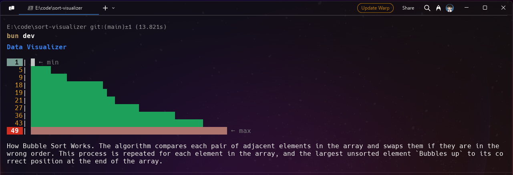
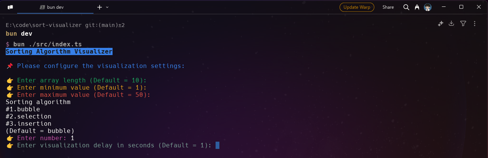

# Sorting Algorithm Visualizer

## Project Overview
This is a command-line based sorting algorithm visualizer built with TypeScript and Bun. The project allows users to visualize different sorting algorithms in action with customizable parameters.

## Preview

<div align="center">
    
    
</div>

## Features
- Interactive command-line interface with colorful output using `chalk`
- Support for multiple sorting algorithms:
  - Bubble Sort
  - Selection Sort
  - Insertion Sort
- Customizable visualization parameters:
  - Array length
  - Minimum and maximum values
  - Visualization delay
- Real-time visualization of the sorting process

## Technical Stack
- **Runtime**: Bun v1.2.5
- **Language**: TypeScript
- **Dependencies**:
  - `chalk`: For colorful console output
  - `readline`: For interactive command-line interface

## Project Structure
```
sort-visualizer/
├── src/
│   ├── index.ts           # Main application entry point
│   └── utils/
│       ├── sort.ts        # Sorting algorithm implementations
│       ├── visualizer.ts  # Visualization logic
│       ├── randomize.ts   # Array generation utilities
│       └── delay.ts       # Delay utilities
├── package.json
├── tsconfig.json
└── README.md
```

## Installation
```bash
bun install
```

## Usage
1. Run the application:
   ```bash
   bun run index.ts
   ```

2. Follow the interactive prompts to:
   - Set array length (default: 10)
   - Define minimum and maximum values
   - Choose a sorting algorithm
   - Set visualization delay

## Implementation Details
- The application uses a modular approach with separate utility files for different functionalities
- Sorting algorithms are implemented in a class-based structure
- The visualization provides real-time feedback of the sorting process
- User input is handled through an interactive command-line interface
- Error handling is implemented for invalid inputs

This project serves as an educational tool to help understand how different sorting algorithms work by providing a visual representation of the sorting process in real-time.
